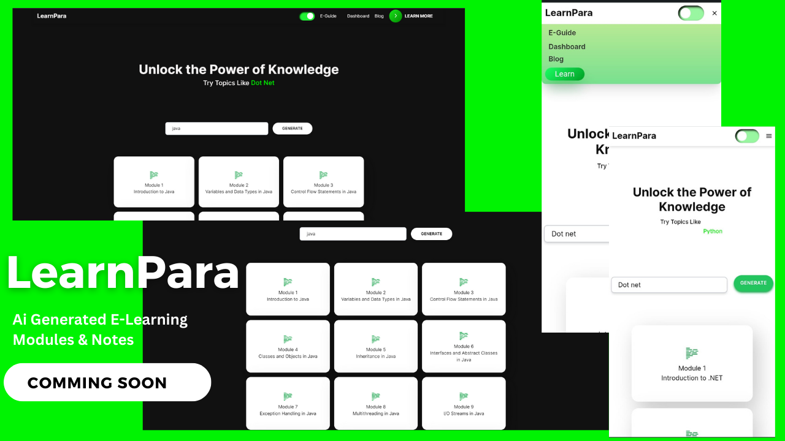
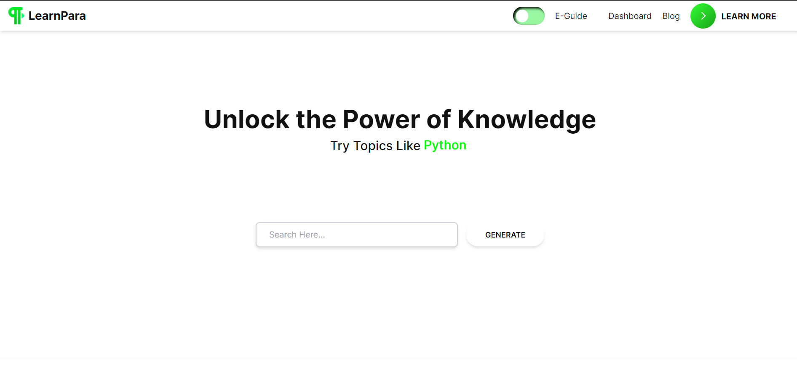
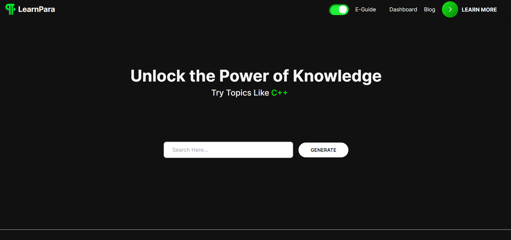

# LearnPara AI

[#Demo](https://youtu.be/I8dPmsUa06U)

## Introduction

Welcome to LearnPara AI, an AI-powered platform designed to help you learn any subject or topic. Whether you're interested in Java, Python, C#, or any other subject, our intelligent system will generate the best topic modules for you to learn. This documentation will guide you through the various features and functionalities of our website.

## Getting Started

To get started, follow these steps:

1. Visit our website at [LearnPara](https://learnpara.vercel.app/).
2. On the homepage, you will find the "LearnPara AI" section.
3. Enter your desired subject or topic into the input field.
4. Click the "Generate Modules" button.

## Module Selection

Once you have generated the modules for your chosen topic, you will see a list of modules displayed on the screen. Each module represents a specific aspect or subtopic of the subject you entered.

Click on any module to explore its subtopics. The subtopics will be displayed as a list. Click on a subtopic to view its detailed information.

## Detailed Information

When you select a subtopic, you will be presented with a detailed explanation of that particular topic. You can click the "Detail" button to expand and get the detailed information.

## Examples and Q&A

Below the detailed explanation, you will find five buttons: Detail, Simplify, Example, Q&A, and Quiz Test.

- **Detail**: Clicking this button will display the detailed explanation in a point-by-point format, making it easier to grasp the key concepts.
- **Simplify**: This button provides a simplified version of the topic's definition and explanation.
- **Example**: Click this button to access real-world examples related to the topic.
- **Q&A**: This button will generate questions and answers based on the subtopic's explanation. It's useful for exam preparation and interviews.
- **Quiz Test**: By clicking this button, you can test your knowledge by taking a quiz based on the subtopic. It helps you evaluate your understanding and retention of the topic.

## Screenshots

## Homepage 
####Light 

#### Dark

## Installation

1. Clone the repository: `git clone https://github.com/VartikAnand/LearnPara-AI.git`
2. Install dependencies: `npm install`
3. Start the development server: `npm run dev`
4. Open your browser and visit: `http://localhost:3000`

##Contributing

We welcome contributions from developers who are interested in improving LearnPara AI. If you would like to contribute, please contact us at vartikkanand@gmail.com

That's it! You should now be able to access and use LearnPara AI on your local machine.

## License

This project is licensed under the [MIT License](LICENSE).
